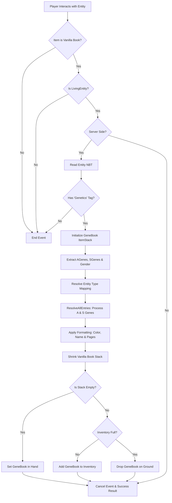

# Genetic Testing

This repository hosts a Minecraft modification with which users are able to gain information about the genetics of animals added by the mod `Genetic Animals`.

## Key Features
Use a vanilla book on any "Genetic Animals" animal to receive a summary of their genetics in a gene book item.

## Getting Started
### Prerequisites
* Minecraft Java Edition (1.20.1)
* Minecraft Forge (47.+)
* Genetic Animals (0_11_12)

## For Developers: Creating New Gene Formats
To add support for a new gene format, extend the `GeneFormatting` class:
```java
public class MyAnimalFormat extends GeneFormatting {
    public MyAnimalformat() {
        setBookColour(0xABCDEF); // Colour of the book
        // Sex-Linked Genes (pulled from SGenes array)
        addCategory("Sex-Linked Traits");
        addSexLinkedPairMapping("Gold", GOLD_GENES, GeneType.POLYMORPHIC, 0);
        addSexLinkedPairMapping("Chocolate", "c", GeneType.BINARY, 1);
        addComment("Add a comment in italics here.");
        // Standard Genes (pulled from AGenes array)
        addCategory("General Genetics");
        addPairMapping("Polymorphic trait", TRAIT_GENES, GeneType.POLYMORPHIC, 1);
        addLineBreak();
        addConditionalComment("§4Warning!", 0, (v1, v2) -> v1 == 2 || v2 == 2);
    }
}
```

Graph that shows how the event is handled when a player interacts with an animal using a vanilla book.


## Mapping Reference

### Gene Pair Mappings
Connect a label to a specific index in the entity's Genetics array. Each gene comes in pairs, so 'dataIndex' refers to the pair rather than the specific position in the array. 
Ex: dataIndex = 5 reads genes 10 and 11 in the Genetics array. 

`addPairMapping(label, value, type, dataIndex)`
For Binary genes. Displays a specific string (like "pa" for Pattern) if the gene is present, or `+` if not.
`addPairMapping(label, valuesList, type, dataIndex)`
For Polymorphic genes. Uses the gene's integer value to select a string from the provided list.
Always ensure your list has a dummy value at index `0`, or use index `1` and `2` purposefully.

#### Sex-Linked Mappings (SGenes)
These behave like standard mappings but pull data from the SGenes array. They also include special logic for gender: Females will only display/calculate the first allele in the pair, while Males display both.

`addSexLinkedPairMapping(label, value, type, dataIndex)`
Registers a binary sex-linked trait.
`addSexLinkedPairMapping(label, valuesList, type, dataIndex)`
Registers a polymorphic sex-linked trait.

### Polygenic Mappings
Used for complex traits influenced by multiple gene locations (loci) rather than a single pair.

`addPolyGeneMapping(label, mappings, rangeStart, rangeEnd)`
**Sums the values** of all genes in a continuous range (inclusive).
*   Maps the total sum to a "fuzzy" selection from the `mappings` list.
*   **Logic:** The lowest possible sum (all 1s) returns the first label; the highest possible sum (all 2s) returns the last. Everything in between is scaled.
*   **Example:** `addPolyGeneMapping("Size", List.of("Small", "Medium", "Large"), 0, 5);` (Checks genes 0 through 5).
If you provide 3 labels ("Small", "Medium", "Large"), the code mathematically splits the range into thirds.

`addPolyScaleMapping(label, mappings, negIndices, posIndices)`
**Weighted calculation** where specific genes increase or decrease a score.
*   `negIndices`: Subtracts 1 from the score if the gene value is 2.
*   `posIndices`: Adds 1 to the score if the gene value is 2.
*   **Logic:** The score starts at 0. The final score is mapped to the `mappings` list, where the center of the list represents a score of 0.
*   **Example:**
```java
addPolyScaleMapping("Temperament", 
    List.of("Aggressive", "Neutral", "Docile"), 
    new int[]{10}, // Gene 10 makes them aggressive
    new int[]{12}  // Gene 12 makes them docile
);
```

### Layout & Organization
Determine the organization of the text on the book pages.

`addCategory(title)`
Adds a Bold/Underlined Header for grouping traits.
`addLineBreak()`
Adds an empty line to separate entries.
`addPageBreak()`
Forces the next entry to start in a new column, each page is its own column.

### Comments & Logic
Add context or warnings based on the animal's specific genetic makeup.

`addComment(text)`
Adds static italicized text. Perfect for flavor text or static notes.
`addConditionalComment(text, dataIndex, condition)`
Also italicized text. Used for the "Lethal Genes". This comment only appears if the specific gene pair meets the defined logic.
Example: addConditionalComment("§4Warning!", 10, (v1, v2) -> v1 == 2 || v2 == 2);
This means if either gene of the 10th dataIndex gene ([20, 21] in the AGenes array) is present, it displays the comment "Warning!" in red.

### Book Colour Customization

`setBookColour(int colour)`
Sets the hex colour of the Gene Book covers for this specific animal.
Example: setBookColour(0xF38B35); // Orange

## Troubleshooting

If the game logs an error or skips a mapping during startup, check the following:

### "Mapping size mismatch"
This is the most common error when using `addPolyScaleMapping`.
*   **The Rule:** The number of labels must be exactly `(Negative Genes + Positive Genes + 1)`.
*   **Why?** If you have 2 negative genes and 2 positive genes, the possible scores are `-2, -1, 0, 1, 2`. That is **5** total possibilities, so you must provide **5** labels.
*   **Log Example:** `Expected 5 labels, got 3.` -> You need to add more strings to your mapping list.

### "Index Out of Bounds"
*   **Agene/SGene Array size:** Ensure your `dataIndex` or `rangeEnd` does not exceed the actual size of the genetics array saved on the entity.
*   **Polymorphic Lists:** If a gene value is `3` but your list only has 2 items, the book will display `?`.

### Sex-Linked Genes not showing
*   Ensure you are using `addSexLinkedPairMapping` and not the standard `addPairMapping`.
*   Check that the entity has the `SGenes` integer array and the `IsFemale` boolean tag in its NBT.

## Authors

This mod was created by Maltshakes and VespeneGas.
- [Maltshakes' CurseForge](https://www.curseforge.com/members/maltshakes/projects)

## Acknowledgements

 - [Genetic Animals on CurseForge](https://www.curseforge.com/minecraft/mc-mods/genetic-animals)
 - [mortuusars for book GUI](https://www.curseforge.com/minecraft/mc-mods/scholar)
